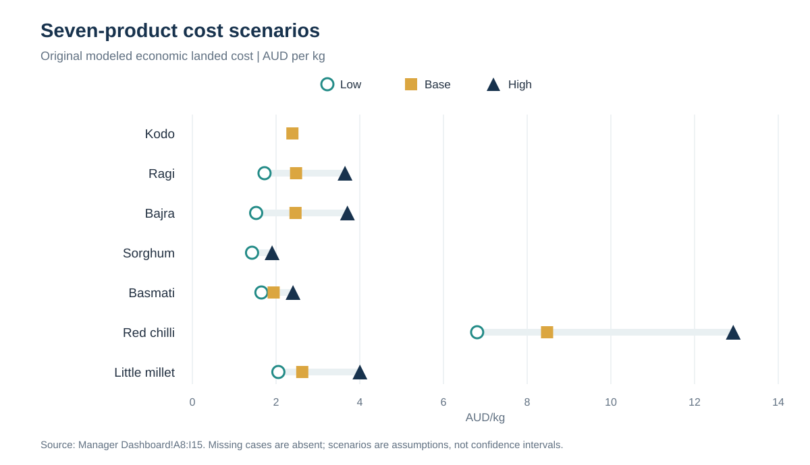
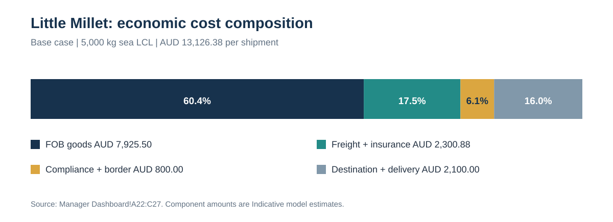
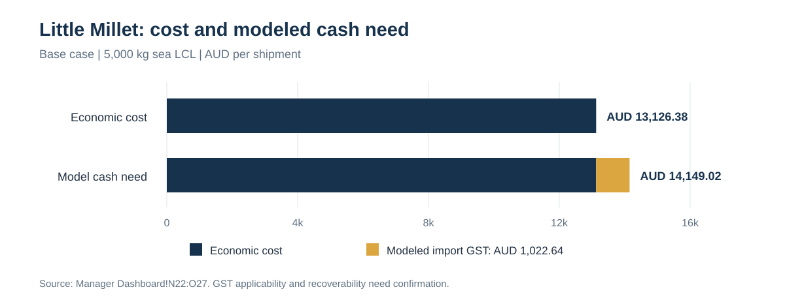
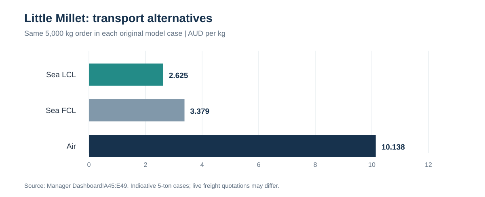

# Australia Product Intelligence & Landed Cost Dashboard

An interim product-intelligence and commercial analysis project for **Liberty Exports** covering seven India-to-Australia food-product cases. The work consolidates separate research models into a manager-facing cost view and a six-page review report. It is designed to make assumptions, cost drivers, and the next evidence required for a shipment decision visible.

**Report date:** 5 October 2026. Each product retains its original research date. All modeled costs are **Indicative**; they are not supplier quotations, live freight rates, or approved import costs.

[Read the six-page manager review report (PDF)](Liberty_Australia_Manager_Dashboard_Review_Report_SybilYan_v1.pdf)

## Business questions

- What does each original Low, Base, or High scenario imply for economic landed cost per kilogram?
- Which costs beyond the goods value drive the result?
- How does modeled cash need differ from economic cost?
- What changes when the transport mode changes at a fixed order quantity?
- Which market observations are useful, and what must be confirmed before a commercial decision?

## Scope and approach

The analysis covers Kodo millet, Ragi, Bajra, Sorghum flour, Basmati rice, red chilli powder, and Little Millet. I aligned the source models to AUD/kg while retaining each product's **form, order quantity, transport mode, exchange-rate direction, and research date**. The resulting summary contains 18 original cost scenarios. Missing cases remain unavailable rather than being estimated.

I reconciled shipment totals against their component costs and checked the per-kilogram calculations, currency conversions, cash differences, and chart labels. The consolidated model documents a Kodo cost-reference correction and insurance-base corrections for two alternative Little Millet routes; the original source workbooks were retained.

| Product and form | Original quantity / route | Low | Base | High |
|---|---|---:|---:|---:|
| Kodo, dehulled grain | 5,000 kg / sea LCL | N/A | 2.391 | N/A |
| Ragi, whole grain | 5,000 kg / sea LCL | 1.724 | 2.477 | 3.647 |
| Bajra, whole raw grain | 5,000 kg / sea LCL | 1.525 | 2.465 | 3.705 |
| Sorghum, food-grade flour | 20,000 kg / sea FCL | 1.426 | N/A | 1.906 |
| Basmati, 1121 steam milled rice | 24,000 kg / sea FCL | 1.650 | 1.941 | 2.405 |
| Red chilli, ground dried | 1,000 kg / sea LCL | 6.806 | 8.476 | 12.924 |
| Little Millet, dehulled grain | 5,000 kg / sea LCL | 2.055 | 2.625 | 4.003 |

*All table values are modeled economic landed cost in AUD/kg. Different forms, order sizes, routes, and dates prevent a direct product-opportunity ranking. Low/Base/High are source-model assumption labels, not statistical confidence intervals.*

## Little Millet case study

The detailed case uses **5,000 kg of dehulled Little Millet** shipped by sea LCL to Melbourne and delivered to an illustrative warehouse. Its Base-case economic cost is **AUD 13,126.38**, or **AUD 2.625/kg**. Goods account for AUD 7,925.50 (60.4%); freight and insurance for AUD 2,300.88 (17.5%); compliance and border costs for AUD 800.00 (6.1%); and destination handling and delivery for AUD 2,100.00 (16.0%). Non-product costs therefore represent **39.6%** of the modeled economic total.

The model cash need is **AUD 14,149.02**. Its AUD 1,022.64 difference from economic cost is the source model's import-GST assumption. This is a modeled total, not a payment calendar or a confirmed tax determination.

For the same 5,000 kg, the saved route cases are **AUD 2.625/kg for sea LCL**, **AUD 3.379/kg for sea FCL**, and **AUD 10.138/kg for air**. FCL is about 28.7% above LCL, and air is about 3.86 times LCL in these specific assumptions. Shipment-specific quotations are needed before selecting a route.

Two Australian online listings saved on **4 October 2026** show 1 kg Little Millet packs at **AUD 5.99 each**: [ICS at Vel Spices](https://velspices.com.au/products/ics-little-millet-1kg) and [Aachi at Grocerz](https://www.grocerz.com.au/product/aachi-little-millet-1kg). Their dehulling status was not established in the saved evidence. These retail observations are not wholesale buyer quotes, a market average, or a basis for calculating margin from the landed-cost model.

## Deliverable

The [manager review report](Liberty_Australia_Manager_Dashboard_Review_Report_SybilYan_v1.pdf) contains five annotated figures across six A4 pages: a seven-product scenario overview, Little Millet cost composition, an economic-cost-to-cash bridge, transport alternatives, and retail price references. Each figure separates its finding, interpretation, limitation, and source. The final page maps reported values back to the original workbook sheets and cell ranges.

## Evidence limits and next actions

Before using the analysis for a shipment or price decision, the business needs to confirm the exact product specifications and processing, applicable Australian import pathway and classification, GST treatment and recoverability, supplier test results and certifications, buyer and label requirements, and freight, broker, inspection, and delivery quotations. The public retailer observations are historical snapshots and may have changed.

The report is an **interim management review**, not a purchase recommendation, import approval, or evidence of customer demand. Broader millet and ground-capsicum trade categories, where used in the source research, are proxies and should not be interpreted as demand for any one product in this portfolio.
